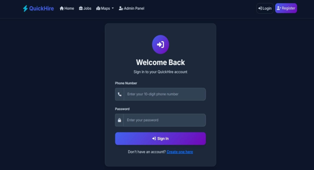
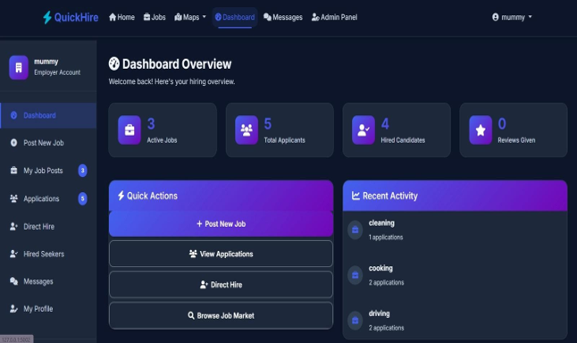
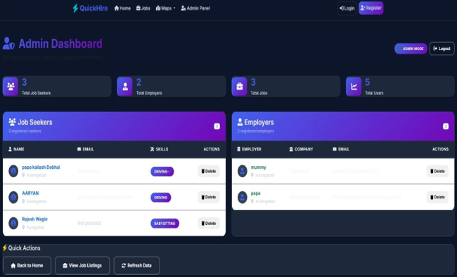

# Quick Hire

Quick Hire is a local workforce hiring platform that connects employers with skilled workers through a simple and user-friendly web application. The platform enables employers to post jobs, manage hiring requirements, and discover workers, while job seekers can create profiles and explore employment opportunities.

## Live Demo

🔗 https://quickhire-secure-recruitment.onrender.com/ 

> Note: The application is hosted on Render's free tier and may take a short time to load on the first visit.
> 
## Features

- User Registration and Login
- Employer and Worker Profiles
- Job Posting and Management
- Worker Listings
- Secure Authentication
- Database Integration using MySQL
- Responsive User Interface
- Search and Hiring Functionality

---

## Tech Stack

### Backend
- Flask
- Python
- SQLAlchemy

### Frontend
- HTML
- CSS
- JavaScript

### Database
- MySQL

### Tools
- Git
- GitHub
- VS Code

---

## Project Structure

```text
quick-hire/
│
├── app/
│   ├── static/
│   ├── templates/
│   ├── forms.py
│   ├── models.py
│   ├── routes.py
│   └── __init__.py
│
├── migrations/
│
├── database/
│   └── QuickHire.sql
│
├── screenshots/
│   ├── login-page.png
│   ├── home-page.png
│   ├── worker-listing.png
│   └── employer-dashboard.png
│
├── config.py
├── migrate.py
├── requirements.txt
├── run.py
└── README.md
```

---

## Screenshots

### Login Page



### Home Page


### Employer Dashboard



### Admin Dashboard



---

## Database

The database schema is included in:

```text
database/quick_hire_db.sql
```

Import the SQL file into MySQL before running the application.

---

## Installation

### Clone Repository

```bash
git clone https://github.com/GauriAsalkar1/QuickHire.git
```

### Create Virtual Environment

```bash
python -m venv venv
```

### Activate Virtual Environment

Windows:

```bash
venv\Scripts\activate
```

### Install Dependencies

```bash
pip install -r requirements.txt
```

### Configure Database

Import:

```text
database/QuickHire.sql
```

into MySQL and update database settings if required.

### Run Application

```bash
python run.py
```

---

## Future Enhancements

- Real-Time Chat System
- Advanced Worker Recommendation
- Location-Based Search
- Rating and Review System

---

## Author

**Gauri Asalkar**

B.Tech Computer Science Engineering

Deogiri Institute of Engineering and Management Studies
